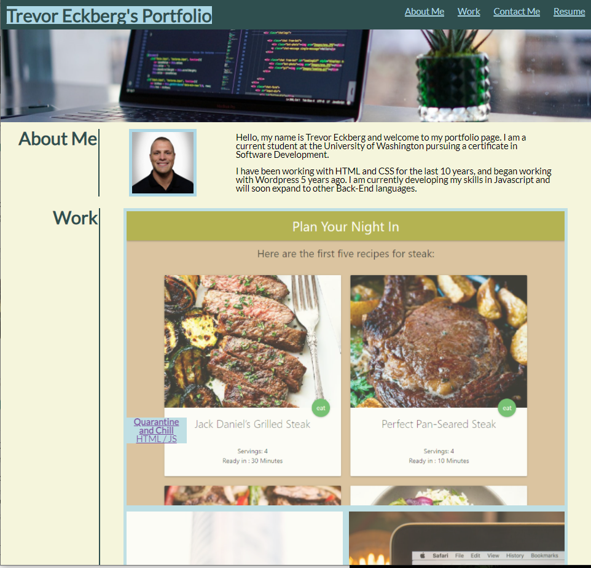

# Css-Portfolio

This website was created using strictly HTML and CSS functioning largely around the use of flex-box containers to enable a responsive layout that works on mobile devices.

The intention of this website is to provide potential employers with a portal to learn more about its creator.

The live web-page can be found at:
https://trev-eck.github.io/css-portfolio/

Further explanation of methods used can be found on internal comments